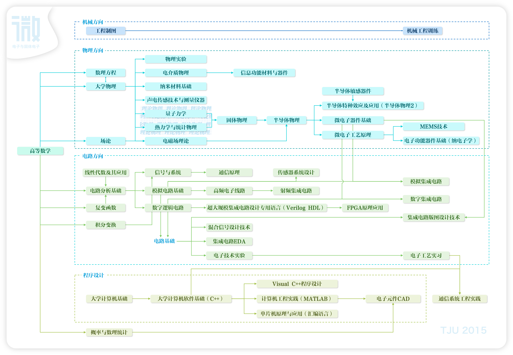

# 令人惊叹的数字IC

## 为什么会有这个项目？

说实话，我一直很羡慕「专业人士」，也特别享受去探索小众领域的过程。
但是在IC学习上我犯了难，我是这个专业的学生，但是我学不懂它，这对一个一直以来学习还不错的学生而言是非常大的打击。
与此同时，我学习了金融、计算机的相关课程，我能够看懂公司财务的知识，也能写漂亮的Python代码，学习对我来说不应该是难事。
我去反思，为什么我不能在这个学科学到相同的深度，当然不能怪自己，要怪就怪没有好的资源。
当然，从我开始留心相关资料的时候，它们好像正在聚合起来，有很多跟我一样的人正在做这件事，他们做得比我更早，也更完善，所以我在最开头先介绍了一些相似的项目。

祝互联网互联。

## 大学课程列表

其实掌握学习方法，最好的起点就是看大学课程设计，别看很多学生吐槽自己的课程，但是微电子科学作为一个老牌专业整个入门体系其实是非常清晰、成熟的。
各个大学的课程其实都可以从四个方向来认识，数学基础、物理基础、程序设计、电路设计。
如果你目标清晰，只是想学一个特定的方向，那么只要 Ctrl + F 就能找到对应的资料；
但如果你和我一样，有机会在大学阶段稳扎稳打，那么这个课程框架能让你少一点迷茫。

### 清华大学

### 北京大学

### 南京大学

### Berkeley - EE

### MIT

### 天津大学

2015 - 2019 课程体系

## 数学方向

从最基本的数学学起吧，这部分是公共课，学的人多，也更容易遇到好资料。
如果你苦恼自己求学无门，因为没有好老师带，那不妨先看看数学，即使你不想做这个方向，数学的知识也不会亏待你。
下面的课程只有高数、线代和概率论是必修的，剩下的课程基本都是给有更高需求的同学准备的。
如果对数学本身很感兴趣，可以查阅一些更专业的推荐：

1. [数学学习路线图 - AlexiaChen](https://github.com/AlexiaChen/AlexiaChen.github.io/issues/105)

### 数学必修课

#### 高等数学 / 微积分 / 数学分析

#### 线性代数 / 高等代数

#### 概率论

### 工程方向的数学

下面讲一些工程、物理上会遇到的问题。
如果你将要研究射频电路，那么信号与系统的相关知识是必不可少的，信号与系统又依赖了复变函数的一些推导。
如果你需要研究电介质物理，那么电磁场理论及边界条件都很重要，场论能将这些内容抽象出来。
当然，并不是说你不学这些数学就没办法学好物理或电路，物理中遇到问题时再去寻找解决方法，因为依托了实际场景可能更容易理解；
而且工程上解决问题依赖的数学方法多数也是皮毛，并不需要你懂如何证明，所以这个部分全定为选修。

### 复变函数（选修）

### 场论（选修）

### 积分变换（选修）

### 数理方程（选修）

### 计算机方向的数学知识

### 离散数学（选修）
这是计算机流派就基础，把计算机方向的东西零零碎碎整理一下，但也不讲太深。

### 集合论（选修）

### 图论（选修）

### 数理逻辑（选修）

### 图论（选修）

### 抽象代数（选修）
抽代中的群，环，域，格也是《密码学》的重要工具，如果学好了更好，但是学不会也不要怕，很多密码学家也是把前人的工作当作黑盒来用的。

### 数理统计（选修）

## 物理方向

### 大学物理

### 量子力学

### 热力学与统计物理

### 电磁场理论

### 半导体物理

### 半导体器件物理

### 半导体特种效应及应用

### 电介质物理

## 工艺流程

### 微电子工艺原理

### MEMS 技术

## 电路方向

### 电路分析基础

### 信号与系统

### 数字电路基础 / 数字逻辑电路

> 组合逻辑和时序逻辑是数字电路的两大类型，掌握基本的设计方法不可少。

### 模拟电路基础

### 高频电子线路

### 数字集成电路

### 模拟集成电路

### 射频集成电路

## 数字电路深入

上面介绍的一些课程都是属于基础课程，但是上课与实践是分不开的，数字 IC 方向的同学应该尽早地开启实践之路，掌握相关的EDA工具，能边动手边学习。
[zip-cpu](http://zipcpu.com/tutorial/) 介绍中提到：

> The digital design student should be introduced immediately not only to the HDL language, but also to the tools necessary to debug his code. This includes not only Verilog (or SystemVerilog), but also a simulator (we’ll use Verilator, augmented at times with ncurses), waveform design (wavedrom or even tikztiming), waveform display (gtkwave), and (my favorite) Formal Verification using SymbiYosys. （数字电路设计的学生不应该只学习HDL语言，也应该学习调试代码的必要工具。不仅仅是Verilog、SystemVerilog，也要学习仿真器、波形生成工具、波形查看器和综合器。）

我看了之后深受感动，确实，我们少了这么一课，在进入正式学习之前我将介绍一些资料帮助大家入门你面前的「计算机」。

### 动手做实验前的基础知识

在正式学习之前，主要主要积累下面四个方向的基础知识：

- 操作系统
    - Linux 安装
    - 命令行操作、基本命令
    - 用户权限
    - 软件安装
- 脚本语言
    - shell 脚本及常见命令行工具
    - Makefile 脚本
    - Perl 或 Python
- 编程语言
    - C 语言基础
    - Python 程序设计
    - Scala 语言基础
- 软件工具使用
    - 版本控制工具
    - 仿真器
    - 波形查看

如果你是计算机的学生，或者有志学习计算机，可以去看看计算机方向少的一课 [MIT missing-semester](https://missing.csail.mit.edu/2020/)。
而如果你是微电子的同学，一生一芯项目的预学习阶段是一个不错的开始 [一生一芯官方文档 - 预学习](https://ysyx.oscc.cc/docs/prestudy/prestudy.html)。

| 教材 | 说明 | 难度 |
| :----------------------------------------------------------- | ---------- | ---------- |
| [Iter Cast - Linux 入门教程](https://www.bilibili.com/video/BV1eK4y1r7Uo/) | 视频讲解，入门级、0 基础、有深度的 Linux 入门教材 | 🌟         |
| [Vim 实用技巧](https://book.douban.com/subject/25869486/) | 书籍，系统讲解了如何用 Vim 的思路编辑文本。 | 🌟🌟🌟        |
| [MIT18.06: Linear Algebra](https://ocw.mit.edu/courses/mathematics/18-06sc-linear-algebra-fall-2011/syllabus/) | 🌟🌟🌟        |

下面的不同部分，可以根据你的需要去单独研究，对应于不同的岗位需求。

### 编程语言与EDA

设计常用的编程语言是Verilog和VHDL。

编程语言不等同于数字电路设计，编程语言仅仅是快捷设计的工具。学数字集成电路设计不仅是学Verilog。

做数字设计的第一步是理解需求，写SPEC设计规范文档。

第二步是分解功能，画框图。

第三步是定义各模块的接口和交互方式。

第四步是定义模块内部的工作方式，状态机，时序图。

最后则是写代码。

Verilog编程语言包括了可综合部分和验证部分，EDA是工具，是辅助设计、提升效率的帮手，但也不能完全依赖工具。

### 写一些实例

基础

运算器、编码器、译码器、串并转换、序列检测。

进阶

CPU核设计（8086、ARM）

总线（Intel、AMBA）

外围功能IP（SPI、IIC）

存储器接口（ROM、RAM、FLASH）

通信、图像、视频等领域的功能模块设计

## 其他人的总结
- [入行10年后，我总结了这份FPGA学习路线 - 老石 - 知乎](https://zhuanlan.zhihu.com/p/345303288)

### 知乎 Topics
- [IC设计](https://www.zhihu.com/topic/21670860/top-answers) 
- [Verilog HDL](https://www.zhihu.com/topic/19609393/top-answers) 

### 如何入门 IC
- [可以推荐一些IC设计的资料和书吗?](https://www.zhihu.com/question/515396181) - 知乎的问题
- [IC读研&校招准备](https://zhuanlan.zhihu.com/p/384459176) - 知乎的文章

> 欢迎北京大学深圳研究生院微电子专业的同学添加学习群，添加时请注明导师：QQ群 250070500；也可以邮件联系学习委员：[673538982@qq.com](mailto:673538982@qq.com)。
> 如果你并不是该专业的同学，那么群中的信息可能对你帮助并不大，可以添加微电子行业交流群：QQ群 830367636。
